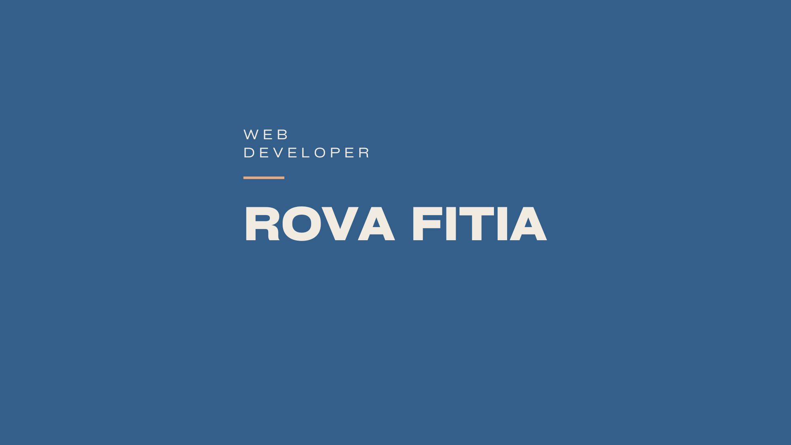

## 👋 Hello everyone!

I am delighted to welcome you to my GitHub profile. I am a web developer passionate about creating innovative and efficient solutions. Here are some of the technologies I regularly work with:

## 😎 About me

I am a freelance front-end and WordPress developer, passionate about web development and always looking for new challenges. My expertise covers both front-end and back-end development, with a strong preference for modern and high-performance technologies.

## 🌱 What I'm currently doing

- 🛠️ Developing innovative web projects.
- 📚 Continuously learning new technologies and improving my skills.
- 🚀 Collaborating with clients to transform their ideas into reality.
